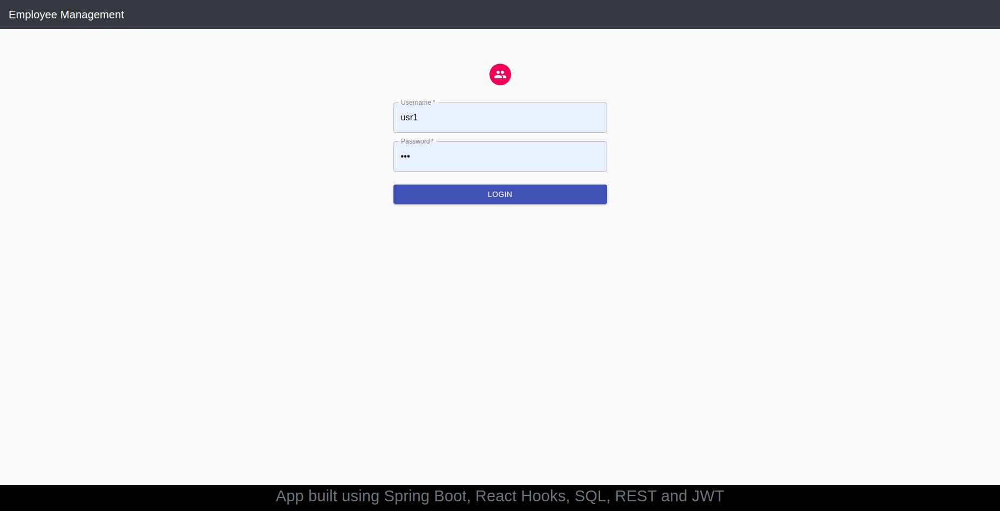
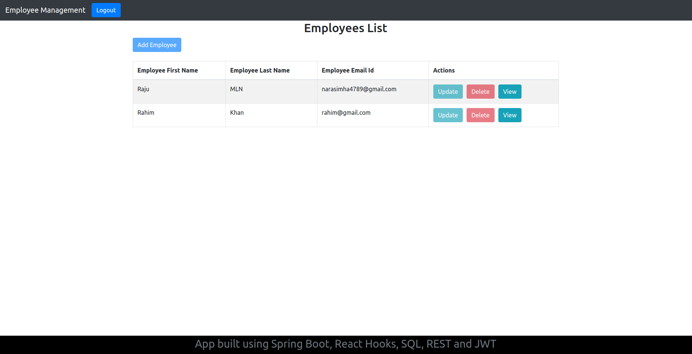
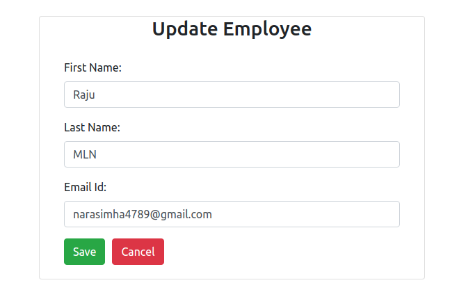

# employee-management

A simple app to maintain employee registry.

## BUILT USING:
React Hooks, Spring Boot, Role based authorisation using JWT and Spring Security, Spring Data JPA, H2(Inmemory SQL database), REST, HTML, CSS, Bootstrap.

__TRY HERE:__ https://emp-man.herokuapp.com/

___USER CREDENTIALS___:

1. Role: ADMIN

____Username____: admin
____Password____: admin

2. Role : USER

____Username:____ usr1
____Password:____ pwd

## Few Screenshots

### Login
  

### Dashboard
  

### Add/Update employee
  
